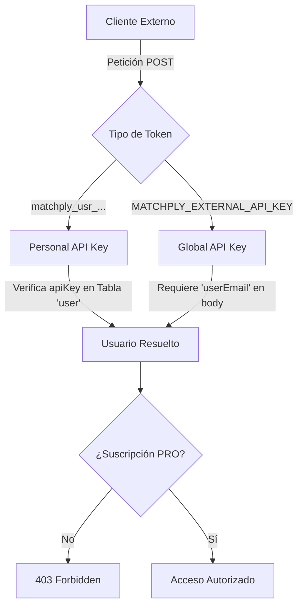
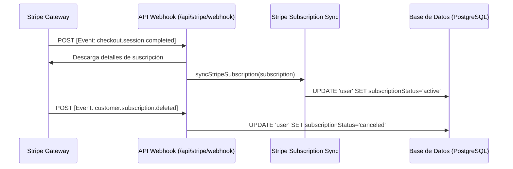

# 🔌 Matchply: Claves, Integraciones y Casos de Uso

Este documento detalla el ecosistema de integración de **Matchply**, explicando el funcionamiento técnico de las API keys, la pasarela de pagos, los motores de IA y ejemplos prácticos de automatización.

---

## 🔑 1. Ecosistema de Claves de API (API Keys)

Matchply ofrece un sistema flexible de autenticación de dos niveles para interactuar con su API externa. Ambas vías operan sobre el protocolo HTTPS seguro utilizando el estándar **JSON Web Tokens** / **Bearer Auth**.



### A. Clave de API Personal (`matchply_usr_...`)
Cada usuario con suscripción **Premium/PRO** activa puede generar su propia clave desde el panel de suscripción.

* **Prefijo distintivo:** `matchply_usr_` seguido de un hash aleatorio criptográficamente seguro de 48 caracteres.
* **Propósito:** Automatizaciones individuales de candidatos, extensiones del navegador, scripts personalizados y portabilidad personal.
* **Seguridad:** Se puede revocar y regenerar al instante en la consola de Matchply, invalidando inmediatamente la clave anterior.

### B. Clave de API Global (`MATCHPLY_EXTERNAL_API_KEY`)
Clave de sistema configurada en las variables de entorno del servidor de producción.

* **Propósito:** Retrocompatibilidad e integración robusta de backend a backend con servicios centralizados o plataformas de terceros asociadas.
* **Particularidad:** Al usar esta clave global, es **obligatorio** proveer el campo `userEmail` en el cuerpo del JSON para determinar sobre qué cuenta de Matchply impactar la sincronización.

---

## 🛠️ 2. Endpoint de Sincronización Externa

El principal punto de acceso para integradores es el endpoint de candidaturas y optimización automática:

> [!NOTE]
> **Endpoint:** `POST /api/external/applications`  
> **Headers:**  
> `Authorization: Bearer <TU_API_KEY>`  
> `Content-Type: application/json`

### Estructura de la Petición (Payload JSON)

El endpoint acepta un objeto altamente detallado que combina el registro de la candidatura, el análisis de IA de la vacante, y el currículum optimizado:

```json
{
  "userEmail": "angelporlandev@gmail.com", // Requerido únicamente si se utiliza la Clave Global
  "title": "Senior Frontend Engineer",      // Requerido (Puesto)
  "company": "Stripe",                      // Requerido (Empresa)
  "url": "https://stripe.com/jobs/123",     // Opcional (URL de postulación)
  "platform": "linkedin",                   // Opcional ('linkedin', 'infojobs', 'indeed', 'other')
  "description": "...",                     // Opcional (Descripción de la oferta)
  "status": "applied",                      // Opcional ('interested', 'applied', 'interview', 'offer', 'rejected')
  "source": "api",                          // Opcional (Origen del scraping)
  "livenessStatus": "active",               // Opcional ('active' | 'expired')
  
  // Evaluación Avanzada de IA (Opcional)
  "scoreOverall": 8.7,
  "scoreBreakdown": {
    "technicalMatch": 9.0,
    "salaryExpectation": 8.0,
    "cultureFit": 9.0
  },
  "tldr": "Excelente oferta con tecnologías modernas, alta flexibilidad horaria y salarios competitivos.",
  "redFlags": ["Requiere presencialidad híbrida 2 días", "Equipo en zona horaria PST"],
  "legitimacyTier": "verified",            // Ghost job detection tier
  "rawReport": "# Reporte Completo de Vacante...",
  
  // Contenido y Estrategia Adaptada (Opcional)
  "cvMarkdownTailored": "# Ángel Porlán\n...", // Markdown optimizado para la vacante
  "targetProofPoints": ["Mejora de rendimiento en un 35%", "Liderazgo de equipo ágil"],
  "coverLetter": "Estimado equipo de Stripe...",
  "outreachMessage": "Hola [Reclutador], vi tu vacante...",
  "interviewStories": [
    {
      "situation": "Migración crítica de base de datos",
      "task": "Migrar PostgreSQL sin caída de servicio",
      "action": "Diseñé un pipeline en Docker con replicación",
      "result": "Migración exitosa con 0 minutos de downtime"
    }
  ],
  
  // Seguimiento
  "nextFollowupDate": "2026-06-15T09:00:00.000Z",
  "rejectionPatternTags": ["salary_mismatch", "seniority_shortage"]
}
```

### Proceso Interno de Ejecución Inteligente
Cuando el endpoint recibe la petición, realiza las siguientes acciones secuenciales:

1. **Autenticación e Identificación:** Valida el Bearer token y localiza al usuario correspondiente.
2. **Validación de Pago (PRO Enforcement):** Verifica en tiempo real mediante `isProSubscription` si el usuario posee una suscripción activa. De lo contrario, retorna un error `403 Forbidden`.
3. **Copia Estética del CV Base:** Si se provee `cvMarkdownTailored`, el sistema busca el CV Base real del usuario en la tabla `cv`. Copia exactamente su configuración visual de plantilla (`templateName`, `accentColor`, `fontFamily`, `scale`, `pageMargin`) y crea un nuevo CV adaptado específico para esta oferta.
4. **Actualización Idempotente (Anti-Duplicados):** Si la postulación ya existe en Matchply (buscando primero por `url` y alternativamente por el par `title` + `company` para el mismo usuario), el sistema **actualiza** todos los campos analíticos, adjuntando el nuevo CV enlazado. Si no existe, realiza un **insert** limpio.
5. **Generación de Logs de Auditoría:** Registra la acción (`job_offer_sync_create` o `job_offer_sync_update`) en la tabla `audit_log` para historial de seguridad.
6. **Revalidación Inmediata de Caché:** Llama a `revalidatePath('/dashboard')` y `revalidatePath('/dashboard/kanban')` para forzar que el tablero visual Kanban del usuario refleje al instante la nueva tarjeta sin necesidad de recargar la página manualmente.

---

## 💳 3. Integración de Pagos con Stripe

La monetización y control de accesos se gestiona por completo mediante un webhook seguro e inteligente acoplado a la API de Stripe.



### Eventos Procesados
* **`checkout.session.completed` / `invoice.payment_succeeded`:** Activa la suscripción en el sistema. Vincula de forma permanente el `stripeCustomerId` y actualiza el `subscriptionStatus` a `active`, liberando al instante la consola de API Keys y las funciones PRO de optimización IA.
* **`customer.subscription.updated`:** Mantiene el estado en sincronía exacta con los ciclos de facturación de Stripe (ej. períodos de gracia, pagos pendientes o reactivaciones).
* **`customer.subscription.deleted`:** Cambia el estado a `canceled`, bloqueando de inmediato el acceso a los endpoints y herramientas Premium de manera no destructiva (el usuario no pierde sus currículums guardados, solo las capacidades de IA y sincronización).

---

## 🤖 4. Motores de Inteligencia Artificial (AIService)

Matchply encapsula toda la interacción con los modelos más avanzados de lenguaje a través de la clase modular `AIService`. Esto permite una transición transparente entre proveedores de primer nivel sin afectar el código de negocio principal.

### Proveedores y Modelos Soportados

| Tipo de Plan | Proveedor por Defecto | Modelo Principal | Endpoint de Conexión |
| :--- | :--- | :--- | :--- |
| **Plan GRATUITO** | **OpenRouter** | `openrouter/free` | `https://openrouter.ai/api/v1/chat/completions` |
| **Plan PRO (Opción A)** | **DeepSeek** | `deepseek-chat` | `https://api.deepseek.com/v1/chat/completions` |
| **Plan PRO (Opción B)** | **Google Gemini** | `gemini-1.5-pro` | `https://generativelanguage.googleapis.com/v1beta/models/...` |

### Modos de Prompting Dinámicos
Los administradores pueden gestionar y actualizar prompts del sistema directamente en producción mediante la tabla relacional `prompt`. 
* **`isStrict` (Rigidez Estructural):** Al activarse, concatena de manera automática la directiva `MARKDOWN_STRUCTURE_INSTRUCTIONS` a las llamadas de IA. Esta regla obliga a los modelos a devolver estrictamente estructuras compatibles con el motor **PDFKit**, asegurando que los títulos de secciones principales `##` y los bloques de experiencia en dos líneas independientes (`### Puesto` seguido inmediatamente de `**Empresa** | *Fecha*`) no se desalineen.

---

## 🚀 5. Casos de Uso Prácticos de Integración

El ecosistema abierto de Matchply habilita la creación de herramientas externas que potencian la experiencia del candidato de maneras innovadoras:

### Caso 1: Extensión de Google Chrome (One-Click Apply & Sync)
Un candidato navega por LinkedIn, InfoJobs o Indeed. Al hacer clic en un botón "Sincronizar con Matchply" de la extensión:
1. La extensión extrae mediante scraping el título, la empresa y la descripción completa de la vacante.
2. Llama al endpoint de Matchply `POST /api/external/applications` inyectando su **Personal API Key**.
3. El Kanban del dashboard de Matchply se actualiza en tiempo real agregando la tarjeta en la columna `interested` (Interesado).
4. El backend genera instantáneamente una sugerencia de CV optimizado al estilo Harvard, lista para descargar.

### Caso 2: Plataforma o Agente de Búsqueda Automatizada (Sincronización Externa)
Un agente automatizado o crawler corporativo de terceros descubre ofertas alineadas al perfil del candidato:
1. El backend del agente procesa la oferta de empleo y realiza un pre-análisis de IA (calcula un match de compatibilidad, extrae TL;DRs, red flags y genera STAR stories para la entrevista).
2. Llama al endpoint utilizando la **Clave Global** (o Clave Personal) indicando el correo electrónico del candidato.
3. El candidato amanece cada mañana con su tablero Kanban pre-poblado de ofertas ya evaluadas y con cartas de presentación personalizadas listas para enviar, ahorrando horas diarias de búsqueda manual.

### Caso 3: CLI Script personal para desarrolladores (Python / Node)
Un programador mantiene su portafolio o repositorio de GitHub y desea buscar empleo de forma automatizada:
```python
import requests
import json

API_KEY = "matchply_usr_c3a7b..."
URL_API = "https://matchply.com/api/external/applications"

payload = {
    "title": "Senior Python Developer",
    "company": "FastAPI Tech",
    "url": "https://example.com/jobs/99",
    "platform": "indeed",
    "status": "applied",
    "description": "Buscamos un experto en Python con conocimientos robustos de Docker y APIs..."
}

headers = {
    "Authorization": f"Bearer {API_KEY}",
    "Content-Type": "application/json"
}

response = requests.post(URL_API, data=json.dumps(payload), headers=headers)
print("Sincronizado:", response.json())
```
Este simple script automatiza por completo la centralización de sus postulaciones directamente desde su terminal.

---

## 🔒 6. Seguridad y Buenas Prácticas

> [!WARNING]
> **No reveles tu clave:** Tu clave de API personal tiene permisos completos de escritura sobre tus candidaturas y currículums. Trátala con el mismo nivel de confidencialidad que una contraseña.
> 
> **En producción:** Si integras Matchply en una aplicación web pública, **nunca** expongas la clave de API en el lado del cliente (Frontend). Realiza la llamada desde tu propio servidor (Backend) para evitar la filtración del token.
