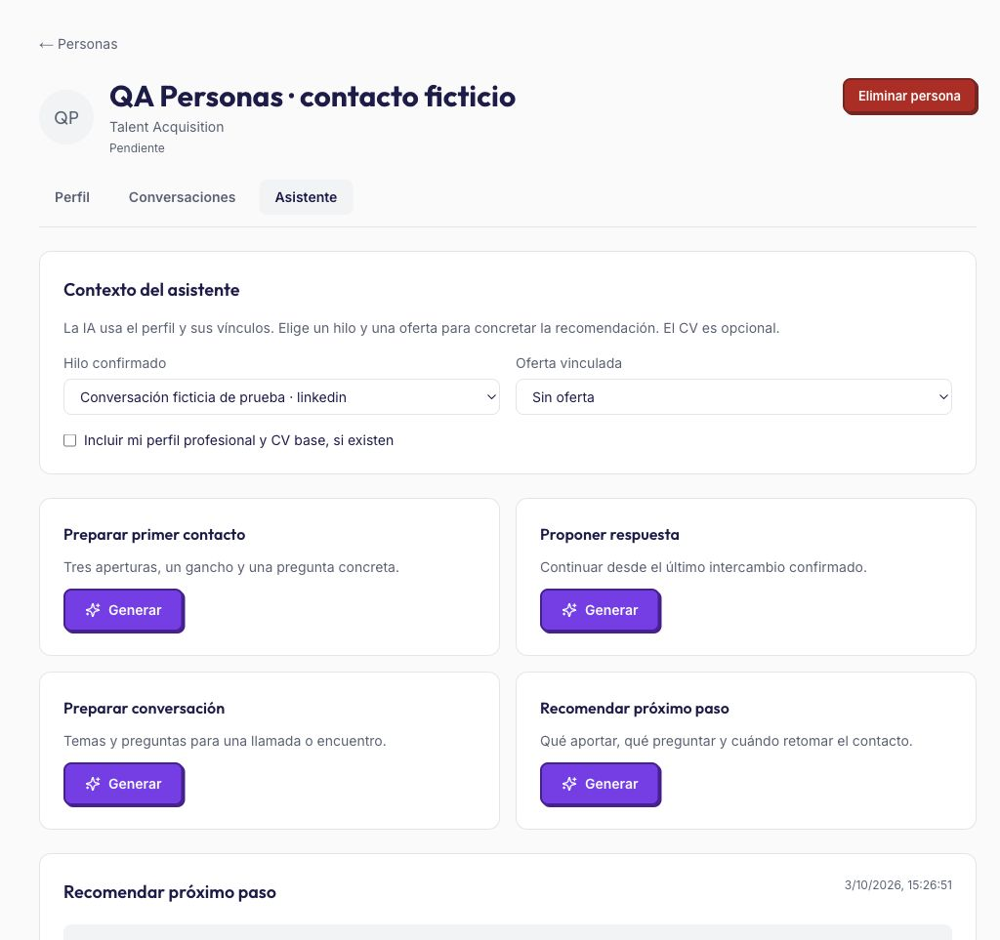

# Evidencias de Personas

Verificado el 03/10/2026 en desarrollo. Implementación del contrato aprobado en [spec.md](spec.md); expectativas trazadas en [expectations.md](expectations.md).

## Comprobaciones automáticas

| Comprobación | Resultado |
|---|---|
| `npm run db:generate` | Migración 0029 generada y revisada; segunda generación sin cambios |
| `npm run db:migrate` en desarrollo | Aplicada correctamente, conservando datos existentes |
| Cadena completa de migraciones en PostgreSQL aislado, inicialmente vacío | 30 migraciones aplicadas; preflight `applied: 30`, `pending: []` |
| Pruebas específicas de Personas y extensión | 17 aprobadas, 0 fallos, 0 omitidas |
| `npm test` con las tres variables de bases de integración configuradas | 304 aprobadas, 0 fallos, 0 omitidas |
| `npm run typecheck` | Aprobado |
| `npm run lint` | Aprobado; diez advertencias previas en componentes ajenos, ninguna en Personas |
| `npm run build` | Aprobado; compila servidor, rutas de Personas/IA/extensión y workers |
| Sintaxis JavaScript de content/background/popup/people | Aprobada con `node --check` |
| `git diff --check` | Sin errores de whitespace |

Los tests de integración se ejecutaron en una base local independiente de desarrollo/producción. `MATCH_BATCH_TEST_DATABASE_URL`, `OFFER_IMPORT_TEST_DATABASE_URL` y `PEOPLE_TEST_DATABASE_URL` apuntaron a esa misma base de prueba ya migrada. Ninguna prueba automática utilizó conversaciones o credenciales reales de usuarios.

- Propiedad: el mismo perfil LinkedIn genera fichas independientes por usuario; las FKs compuestas rechazan vínculos ajenos. Los nombres sin URL no se fusionan. Varios vínculos de empresa/oferta son compatibles y no identifican agencia con cliente.
- Listados: paginación de 25 y proyección explícita, sin notas, originales, mensajes, informes ni CVs. Revisión de la página confirma que sus props/RSC solo reciben esa proyección y opciones pequeñas. Conversaciones y resultados se cargan en el detalle.
- Importación: original conservado, rangos literales por fragmento, autores/fechas revisables; solo confirmación añade mensajes. Repetición idéntica y confirmación simultánea no duplican. Textos repetidos legítimos sobreviven; los solapamientos se comparan en orden.
- IA: prueba de Responses con `store:false`, JSON Schema y modelo de networking; funcionamiento sin CV, contexto desactualizado, clave ausente/salida inválida, errores transitorios, idempotencia por petición y un trabajo activo por persona. Un lease antiguo, una persona eliminada o una oferta elegida eliminada durante procesamiento impiden publicar resultados.
- Captura: fixtures DOM para anunciante, modal abierto y resumen sin perfiles; pruebas del background para ingesta antigua, endpoint adicional y fallo parcial. La captura posterior conserva puntuación, informe y carta, preserva ediciones manuales y no llama a IA.
- Regresiones: suite completa incluye la importación de ofertas por URL que ya existía en la rama. Se conserva ese trabajo.

## Comprobación desde navegador

Se creó un contacto ficticio en desarrollo y un hilo de LinkedIn ficticio. Se comprobó:

1. Alta desde Personas y lectura de perfil/hilo.
2. Una llamada real a GPT-6 Luna organizó tres mensajes; se confirmaron dos y el historial mostró únicamente esos dos.
3. Repetir el mismo texto mostró «ya confirmada» y mantuvo dos mensajes, sin una nueva llamada de análisis.
4. Una segunda llamada real a Luna generó «Recomendar próximo paso» sin incluir perfil/CV ni oferta. Hechos, hipótesis, recomendaciones y borrador aparecieron separados.
5. Confirmar el seguimiento guardó la próxima acción. El resultado pasó a desactualizado y su botón quedó deshabilitado.
6. Las flechas del teclado cambiaron de pestaña. Se revisaron español/inglés, claro/oscuro, escritorio y viewport móvil de 390 × 844; sin desbordamiento horizontal en móvil. La consola no mostró errores durante la revisión.

Se restauraron idioma, tema y tamaño del navegador al terminar. Se eliminó exclusivamente el contacto ficticio de QA, con sus hilos, originales y resultados; no se modificaron contactos reales.

[Asistente en móvil, inglés y tema oscuro](evidence/asistente-movil-oscuro.jpg).

## Estado de entrega y límites

Código, migración, especificación y evidencias listos en desarrollo. No se ha distribuido un paquete nuevo de extensión ni se ha modificado producción. La extensión del repositorio conserva su destino local; el paquete de producción deberá usar `https://matchply.com` después del despliegue de servidor y worker.

El despliegue usa el workflow de `main`. La rama de trabajo ya contenía un commit de importación de ofertas por URL aún no integrado en `main`; publicar esta rama incluiría ambas funcionalidades. La integración y el despliegue se resolverán con el usuario antes de publicar ese trabajo previo.

La revisión visual fue con una sesión registrada PRO; el acceso Gratis y la exclusión de invitados se verificaron mediante permisos y pruebas de integración. La extracción LinkedIn se probó con fixtures representativos del DOM observado; no se ha distribuido ni validado una instalación nueva de la extensión contra todas las variantes de LinkedIn. Cambios futuros de su DOM pueden requerir actualizar selectores.
