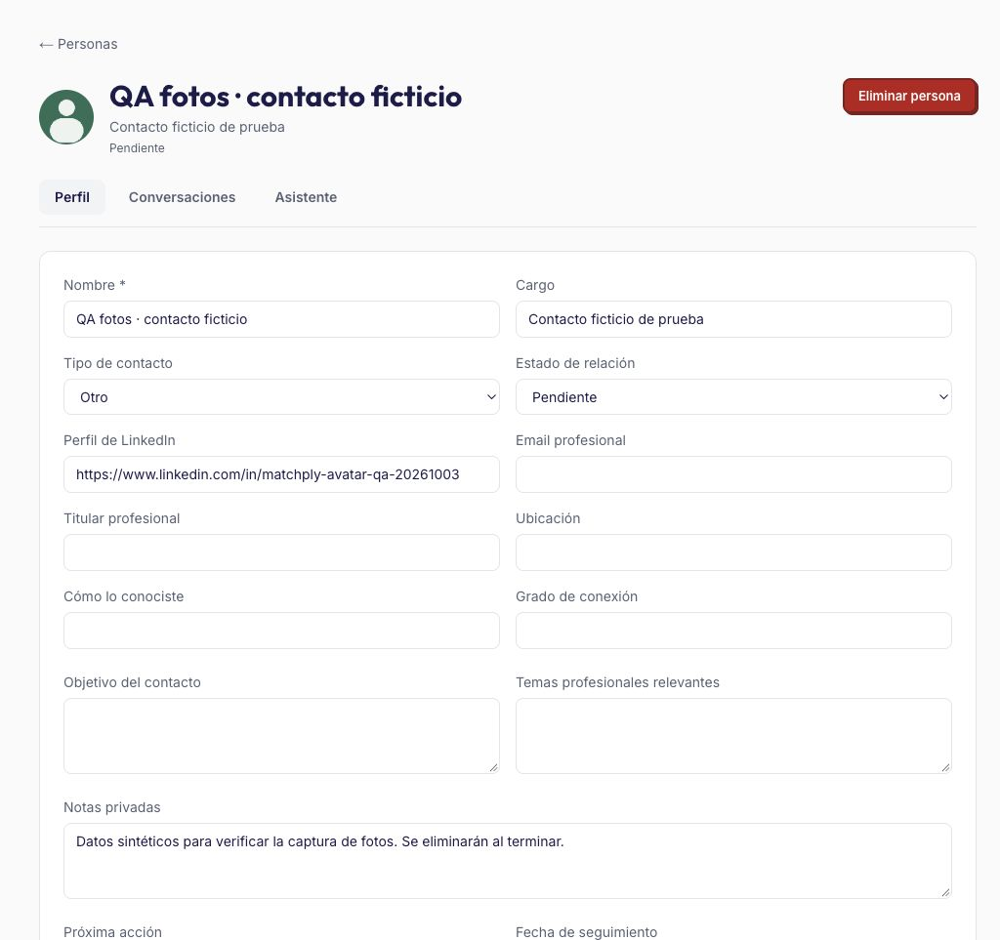
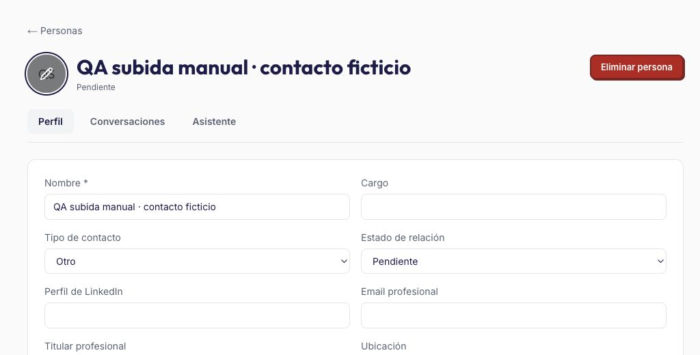

# Evidencias de Personas

Verificado el 03/10/2026 en desarrollo. Implementación del contrato aprobado en [spec.md](spec.md); expectativas trazadas en [expectations.md](expectations.md).

## Comprobaciones automáticas

| Comprobación | Resultado |
|---|---|
| `npm run db:generate` | Migración 0029 generada y revisada; segunda generación sin cambios |
| `npm run db:migrate` en desarrollo | Aplicada correctamente, conservando datos existentes |
| Cadena completa de migraciones en PostgreSQL aislado, inicialmente vacío | 30 migraciones aplicadas; preflight `applied: 30`, `pending: []` |
| Pruebas específicas de Personas y extensión | 17 aprobadas, 0 fallos, 0 omitidas |
| `npm test` con las tres variables de bases de integración configuradas | 304 aprobadas, 0 fallos, 0 omitidas |
| `npm run typecheck` | Aprobado |
| `npm run lint` | Aprobado; diez advertencias previas en componentes ajenos, ninguna en Personas |
| `npm run build` | Aprobado; compila servidor, rutas de Personas/IA/extensión y workers |
| Sintaxis JavaScript de content/background/popup/people | Aprobada con `node --check` |
| `git diff --check` | Sin errores de whitespace |

Los tests de integración se ejecutaron en una base local independiente de desarrollo/producción. `MATCH_BATCH_TEST_DATABASE_URL`, `OFFER_IMPORT_TEST_DATABASE_URL` y `PEOPLE_TEST_DATABASE_URL` apuntaron a esa misma base de prueba ya migrada. Ninguna prueba automática utilizó conversaciones o credenciales reales de usuarios.

- Propiedad: el mismo perfil LinkedIn genera fichas independientes por usuario; las FKs compuestas rechazan vínculos ajenos. Los nombres sin URL no se fusionan. Varios vínculos de empresa/oferta son compatibles y no identifican agencia con cliente.
- Listados: paginación de 25 y proyección explícita, sin notas, originales, mensajes, informes ni CVs. Revisión de la página confirma que sus props/RSC solo reciben esa proyección y opciones pequeñas. Conversaciones y resultados se cargan en el detalle.
- Importación: original conservado, rangos literales por fragmento, autores/fechas revisables; solo confirmación añade mensajes. Repetición idéntica y confirmación simultánea no duplican. Textos repetidos legítimos sobreviven; los solapamientos se comparan en orden.
- IA: prueba de Responses con `store:false`, JSON Schema y modelo de networking; funcionamiento sin CV, contexto desactualizado, clave ausente/salida inválida, errores transitorios, idempotencia por petición y un trabajo activo por persona. Un lease antiguo, una persona eliminada o una oferta elegida eliminada durante procesamiento impiden publicar resultados.
- Captura: fixtures DOM para anunciante, modal abierto y resumen sin perfiles; pruebas del background para ingesta antigua, endpoint adicional y fallo parcial. La captura posterior conserva puntuación, informe y carta, preserva ediciones manuales y no llama a IA.
- Regresiones: suite completa incluye la importación de ofertas por URL que ya existía en la rama. Se conserva ese trabajo.

## Comprobación desde navegador

Se creó un contacto ficticio en desarrollo y un hilo de LinkedIn ficticio. Se comprobó:

1. Alta desde Personas y lectura de perfil/hilo.
2. Una llamada real a GPT-6 Luna organizó tres mensajes; se confirmaron dos y el historial mostró únicamente esos dos.
3. Repetir el mismo texto mostró «ya confirmada» y mantuvo dos mensajes, sin una nueva llamada de análisis.
4. Una segunda llamada real a Luna generó «Recomendar próximo paso» sin incluir perfil/CV ni oferta. Hechos, hipótesis, recomendaciones y borrador aparecieron separados.
5. Confirmar el seguimiento guardó la próxima acción. El resultado pasó a desactualizado y su botón quedó deshabilitado.
6. Las flechas del teclado cambiaron de pestaña. Se revisaron español/inglés, claro/oscuro, escritorio y viewport móvil de 390 × 844; sin desbordamiento horizontal en móvil. La consola no mostró errores durante la revisión.

Se restauraron idioma, tema y tamaño del navegador al terminar. Se eliminó exclusivamente el contacto ficticio de QA, con sus hilos, originales y resultados; no se modificaron contactos reales.

[Asistente en móvil, inglés y tema oscuro](evidence/asistente-movil-oscuro.jpg).

## Estado de entrega y límites

Código, migración, especificación y evidencias listos en desarrollo. No se ha distribuido un paquete nuevo de extensión ni se ha modificado producción. La extensión del repositorio conserva su destino local; el paquete de producción deberá usar `https://matchply.com` después del despliegue de servidor y worker.

El despliegue usa el workflow de `main`. La rama de trabajo ya contenía un commit de importación de ofertas por URL aún no integrado en `main`; publicar esta rama incluiría ambas funcionalidades. La integración y el despliegue se resolverán con el usuario antes de publicar ese trabajo previo.

La revisión visual fue con una sesión registrada PRO; el acceso Gratis y la exclusión de invitados se verificaron mediante permisos y pruebas de integración. La extracción LinkedIn se probó con fixtures representativos del DOM observado; no se ha distribuido ni validado una instalación nueva de la extensión contra todas las variantes de LinkedIn. Cambios futuros de su DOM pueden requerir actualizar selectores.

## Ampliación verificada: foto del contacto (extensión 2.2.0)

- Migración 0030 generada y revisada: tabla privada `person_avatar`, FK compuesta con cascada, índice por usuario y `person.avatarHash`. Aplicada en desarrollo y en la base aislada; segunda generación sin diferencias y preflight `applied:31`, `pending:[]`.
- Suite completa: **310 pruebas aprobadas**, sin fallos ni omisiones. Pruebas específicas tras la última adaptación del extractor: **23 aprobadas**. Typecheck, lint y build aprobados; se conservan las diez advertencias previas de lint y no aparecen nuevas.
- El DOM visible de la oferta abierta confirmó que la foto del anunciante es una imagen hermana de `hirer-information`, enlazada al mismo perfil, y utiliza la variante `profile-framedphoto-shrink`. Se admiten fotos con marco y sin marco. No se copió ni modificó una foto real durante QA.
- Tests del worker de extensión: metadata antes de foto, miniatura JPEG acotada, descarga sin cookies/token, fuentes ajenas rechazadas, opt-out respetado, fallo de descarga/subida conserva contacto/oferta y deja reintento con cooldown. El tiempo total de la fase de fotos está acotado y se limita su concurrencia.
- Tests de servidor: formato/base64/dimensiones/tamaño, propiedad y oferta vinculada, rechazo de FKs ajenas, conservación de foto anterior ante entrada inválida, cascada al borrar persona, sin bytes en listado y sin foto ni `avatarHash` en contexto IA. Guardar una foto no cambia el hash de contexto ni llama a IA.
- Prueba HTTP real en desarrollo con dos usuarios gratuitos y token de extensión sintéticos: guardar la foto devolvió `200`; sin token `401`, oferta ajena `404`, JPEG inválido `400`, invitado `403` y token revocado `401`. Se retiraron los usuarios y todos sus registros de prueba al terminar.
- Navegador: contacto/oferta sintéticos y JPEG de prueba de 1.896 bytes. La ficha cargó desde el endpoint privado (96 px originales, 56 px en pantalla); la tarjeta móvil mostró 40 px y no desbordó un viewport de 390 × 844. Retirar únicamente la foto ficticia produjo iniciales `QF` al recargar. Una petición HTTP sin sesión recibió `403`, con `Cache-Control:no-store`.
- Se restauró el viewport y se retiraron exclusivamente el contacto, imagen y oferta sintéticos. Los contactos reales permanecieron intactos. El fixture JPEG está en `scripts/fixtures/person-avatar.jpg` para pruebas reproducibles.

[Tarjeta móvil con foto](evidence/foto-movil.jpg).

La extensión instalada no se recargó ni se distribuyó durante esta ampliación. Para probar el código local hay que recargar la extensión 2.2.0 y la pestaña de LinkedIn con «Capturar personas» activo. Se mantiene pendiente el despliegue de producción descrito anteriormente; servidor/migración deben publicarse antes de distribuir la extensión nueva.

## Ampliación: subida manual desde el avatar

- Migración 0031 revisada: añade únicamente procedencia `source`, con valor inicial `linkedin`, para conservar las fotos existentes. Aplicada en desarrollo y en la base aislada.
- Suite completa: **311 pruebas aprobadas**, sin fallos ni omisiones. Typecheck, lint y build aprobados; las advertencias de lint siguen siendo las anteriores. El build final incluye la edición desde la cabecera.
- Integración: subida sin oferta ni LinkedIn, propiedad por usuario, entrada inválida conserva imagen anterior, prioridad manual incluso ante captura concurrente, cascada y contexto IA sin cambios.
- HTTP real con usuarios gratuitos sintéticos: subida `200`, sin sesión `401`, persona ajena `404`, JPEG inválido `400`, origen ajeno `403`, cuerpo excesivo `413`, invitado `403`. La foto previa permaneció intacta tras todos los errores. Los usuarios de prueba se retiraron al terminar.
- Navegador: botón en el avatar de cabecera y ausencia del bloque duplicado; enfocarlo con Tab muestra oscurecimiento y lápiz (`opacity:1`, `:focus-visible`). El botón abrió el selector de archivos. La automatización de la selección del archivo local quedó limitada por el permiso de acceso a archivos de la extensión de navegador de Codex; no se concedieron permisos adicionales. La validación HTTP y de persistencia se completó por separado, sin afirmar una subida de archivo de extremo a extremo desde ese navegador.
- Se usó exclusivamente un contacto ficticio para la revisión y se retiró al terminar. Los contactos reales no se modificaron.

La subida manual y el cambio visual están preparados en desarrollo; todavía no desplegados en producción.
